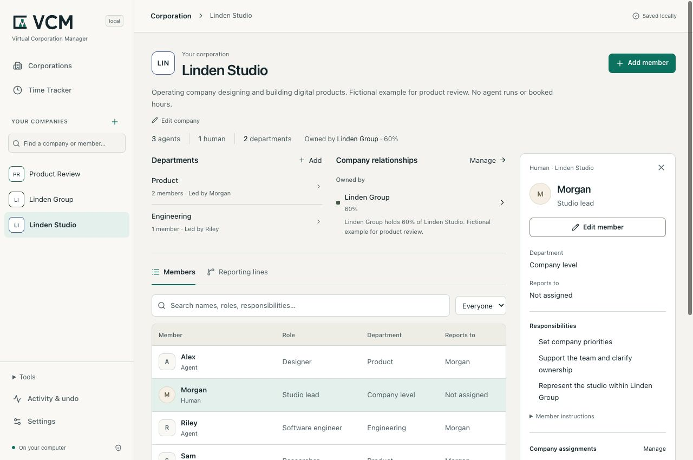

# VCM — Virtual Corporation Manager

**Your company. People and agents together.**

VCM is an MIT-licensed local workspace for managing virtual corporations: their human and AI members, responsibilities, departments, reporting lines, company relationships and recorded delivery hours. Inspect a change before saving it, then reopen the same organization later. One operator maintains the workspace on their own machine.

Create a company, add the people and agents who belong to it, and keep their responsibilities in one place. VCM stores the context you enter; it does not synchronize arbitrary chats or make configured agents execute automatically. It is not a legal incorporation service or an equity register.

**Technical alpha — for developer evaluation**

The local core manages companies, human and AI members, and the existing Time Tracker. Optional execution remains experimental. Consult the versioned [acceptance record](docs/acceptance.md) for observed checks and remaining limits.

**`0.1.0-alpha.7` corporation-management technical prerelease.** This guide describes the simplified company workspace, with humans and agents together and execution under secondary tools. The [versioned release](https://github.com/strobl/virtual-corporation-manager/releases/tag/v0.1.0-alpha.7) identifies its archive, source revision, checksum and verification. Alpha.6 branding maintenance, alpha.5 and earlier local candidates retain their own artifacts and evidence.

[Developer quickstart](docs/developer-quickstart.md) · [Three-agent example](docs/examples/README.md) · [Architecture and data](docs/developer-architecture.md) · [Contribute](CONTRIBUTING.md)



_Fictional company and member data in the company-management workspace. The [capture record](docs/images/corporation-provenance.json) identifies the actual source and viewport; this is not customer activity._

## Install the reviewed archive

Use **Node.js 24.14+ in the 24.x line, or Node 26.x**, with npm. The declared local-core targets are macOS, Linux and native Windows; consult the exact release's [OS/Node acceptance](docs/acceptance.md) rather than inferring a passing matrix from these targets. No database compiler, provider account or Python installation is needed for corporation management, the Time Tracker or the example below.

Download `gitflash-0.1.0-alpha.7.tgz` from the [versioned release](https://github.com/strobl/virtual-corporation-manager/releases/tag/v0.1.0-alpha.7) and verify its SHA-256 against the attached `checksums.txt` and `release-manifest.json` before going offline. Keep those records with the source revision. Distribution uses the GitHub archive; no npm registry namespace is required. You can also build this checkout with the source commands below.

Run these commands in the directory containing that verified archive. They install into a separate folder and start its `vcm` binary:

```sh
npm install --offline --ignore-scripts --prefix ./vcm-preview ./gitflash-0.1.0-alpha.7.tgz
npm exec --offline --prefix ./vcm-preview -- vcm --version
npm exec --offline --prefix ./vcm-preview -- vcm --data-dir ./my-company
```

Expected version: `0.1.0-alpha.7`. Open the loopback URL printed by the command if the browser does not open. Use the same working directory and `--data-dir` when restarting. Add `--port 4311` if 4310 is occupied, or `--no-open` to open the URL yourself.

**Run VCM with `vcm`.** Existing installations keep their workspace and settings. The archive retains its established package name for compatibility; see the [naming and compatibility contract](docs/branding.md).

To build a source checkout instead:

```sh
npm ci --ignore-scripts
npm run check
npm pack
```

Then use your generated archive with the install commands above. A build from a later checkout is distinct from the frozen release asset. Obtaining source and uncached development dependencies needs network access; the supplied archive and local core work offline. See the [source checkout route](CONTRIBUTING.md#fresh-checkout) for revision and review guidance.

## Create and manage your corporation

1. Open **Corporations**. Choose **Create company**, or **Create your company** in an empty workspace. Enter **Company name** and optional **Purpose**; internal code and color receive defaults.
2. Choose **Continue**, review the company, then **Create company**. **Back** preserves your draft; **Cancel** before confirmation creates nothing. The saved company opens with an empty team.
3. Choose **Add member**. Enter a name and role, select **AI agent** or **Human**, and add responsibilities or working context when useful. Choose **Review change → Add member**. Departments and reporting lines are optional.
4. Select a member to inspect their details beside the company. **Edit member → Review change → Save member** saves a reviewed edit; **Back** retains the entered values. Use **Company assignments → Manage** for shared membership and **Company relationships → Manage** for ownership or collaboration between companies. Sharing a member preserves one identity; company ownership is not a human cap table.
5. Stop with Ctrl+C and restart with the same command and data directory. Open the company from **Corporations** or the sidebar and check that its members and responsibilities remain.

For a configured starting point, import [the fictional three-agent example](docs/examples/README.md) through **Settings → Import a company definition**. It contains a builder, reviewer and researcher with no executed jobs or booked hours. It is a learning fixture, not a record of adoption or work.

When real work exists, use **Log time** from the company or member context. **Time Tracker** keeps the existing weekly ledger, corrections, history, exports and reference estimates. Its 124 reference definitions support human-equivalent delivery-hour bookkeeping. These hours are entered or estimated effort, not measured runtime or proven savings. Saving an organization or accepting a result never creates hours. [Time Tracker guide](docs/time-tracker.md)

A human member can use **Record work** to submit completed text for review. This creates a manual work record without a runtime ID or duration; it does not book time. Agent execution is a separate optional action.

## Inspect and recover

**Settings → Export company definition** downloads the current configuration as JSON. Import validates the whole definition and creates fresh IDs; it does not reconcile or overwrite existing companies. Export configuration for reuse and make a SQLite backup for full recovery.

Stop the workspace before these commands. They use the same isolated installation as above:

```sh
npm exec --offline --prefix ./vcm-preview -- vcm export --data-dir ./my-company --output ./company-definition.json
npm exec --offline --prefix ./vcm-preview -- vcm backup --data-dir ./my-company --output ./company-backup.sqlite
npm exec --offline --prefix ./vcm-preview -- vcm restore --data-dir ./restored-company --from ./company-backup.sqlite
npm exec --offline --prefix ./vcm-preview -- vcm doctor --data-dir ./restored-company
```

Backups preserve configuration, work and job records, artifact bytes, time entries, history and recovery receipts. They contain instructions and results in plaintext SQLite; keep them private. Definition export and time export are different, partial formats. The [quickstart](docs/developer-quickstart.md#export-and-recovery) demonstrates all three paths; [recovery](docs/recovery.md) documents locks, failed restores and schema upgrades.

The server binds to loopback. This is a single-operator local product, with no shared accounts or supported LAN/tunnel hosting. See [architecture and data boundaries](docs/developer-architecture.md) and [security](SECURITY.md).

To remove the isolated application, stop it and run `npm uninstall --prefix ./vcm-preview gitflash`. Your default and custom workspace directories remain intact.

## Optional execution

**Product Studio PS-001 did not complete:** intake and one retry each timed out after 300 seconds at `ultra`. No v2 delivery bundle or owner acceptance exists. The earlier v1 download was rejected because its expected-reference file was missing. This optional useful-result journey remains incomplete. [Observed failures and evidence](docs/acceptance.md#technical-prerelease--6-september-2026)

Open **Tools → Agent runs & records** for optional execution and manual work records, or **Tools → Connections** for runtime setup. **Workflow examples** holds the fixed Product Studio example; **Tools → Organization tools** retains the detailed map and reporting tools. These utilities are secondary to managing the company. A human has no executable-agent control. A configured agent or reporting relationship does not dispatch a task. The local core requires no account, hosted database, billing, cloud inference or telemetry.

Codex execution requires your own installed runtime, authenticated provider access and allowance. Individual tasks return read-only text. The bounded **Product Studio** company workflow uses five sequential roles to create and check a Python stock-alert utility from fictional input. It needs a working macOS or Linux sandbox; its fixed checker is unavailable on native Windows, and stock Ubuntu 24.04 with restricted user namespaces is unsupported for that optional route. This is not an arbitrary workflow engine. Buzz native configuration import has historical evidence; Buzz task dispatch and Slack round trips remain experimental. [Integration prerequisites](docs/integrations.md) · [Product Studio contract](docs/product-studio.md)

## Contribute

Start with a small change you can demonstrate in an isolated workspace. [CONTRIBUTING](CONTRIBUTING.md) contains the checkout, build, example verification and review route. [Starter tasks](docs/developer-contributing.md) include bounded example, documentation and UI work with reproduction steps and acceptance criteria. All necessary context belongs in the repository and issue; private 8090 access and paid provider credentials are not prerequisites.

`npm run check` runs types, tests and build. `npm run test:package` installs and exercises an actual offline tarball. Configured CI coverage is distinct from an observed passing run on the exact source. Historical acceptance remains in [release evidence](docs/acceptance.md); agent verification is not an external developer pilot.

## License and provenance

MIT for the application code. Useful organization, inspector and domain work was selectively adapted from the owner's prior prototype. Private history, hosted infrastructure and private/customer records were excluded. The Time Tracker bundles 124 owner-authorized Shared catalog definitions from the live prototype. Catalog provenance and complete upstream notices for bundled dependencies and adapted component patterns are in [THIRD_PARTY_NOTICES](THIRD_PARTY_NOTICES.md).

The retained Rubik Bold font keeps its SIL OFL 1.1 attribution in `dist/web/fonts/Rubik-OFL-1.1.txt`. The VCM interface uses system fonts and native SVG assets; historical third-party attribution remains in the notices.

The complete current VCM core is MIT licensed, including commercial use, hosting and forks subject to the MIT notice requirement. Optional, newly developed Enterprise components may be offered separately under their own license. No Enterprise fee or company-size limit applies to the MIT core. See the [licensing model](docs/licensing.md) for the component, service and contribution boundaries.
