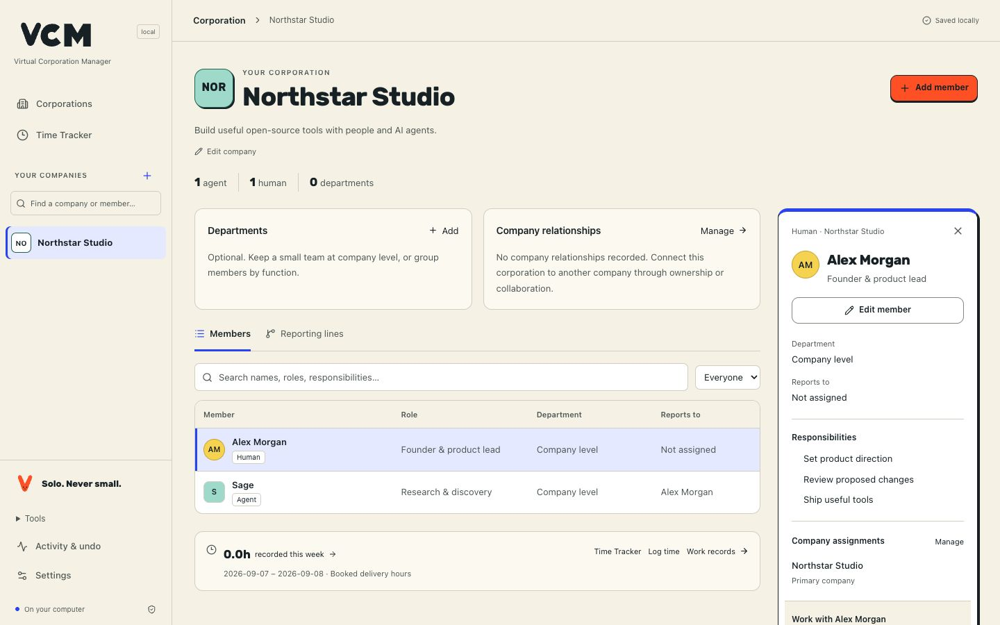
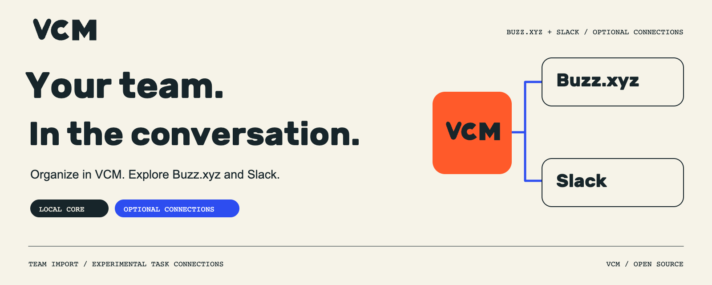

[](https://virtualcorporationmanager.com/)

<p align="center">
  <a href="https://virtualcorporationmanager.com/">Website</a> ·
  <a href="#install-vcm"><strong>Get VCM →</strong></a> ·
  <a href="docs/developer-quickstart.md">Quickstart</a> ·
  <a href="docs/examples/README.md">Try the example</a> ·
  <a href="#build-the-team-bring-it-to-buzz">Buzz + Slack</a> ·
  <a href="#contribute">Contribute</a>
</p>

# VCM — Virtual Corporation Manager

**Big ideas deserve a team.**

Bring people and AI agents into one local workspace. Give everyone a role, make responsibilities clear, and pick up where you left off.

**Free and open source · MIT licensed · Local SQLite · No account required**

## Put your team in the picture

| Your corporation                                                                           | Your team                                                                                 | Your context                                                                                              |
| ------------------------------------------------------------------------------------------ | ----------------------------------------------------------------------------------------- | --------------------------------------------------------------------------------------------------------- |
| Start with a name and a purpose. Manage departments and company relationships as you grow. | Add humans and AI agents. Define responsibilities, shared membership and reporting lines. | Review changes before saving. Record work and delivery hours. Export your setup or back up the workspace. |

The local core works offline with no hosted database, cloud inference, billing or telemetry. One operator maintains the workspace on their machine. Membership and reporting lines describe the organization; agent execution is a separate, optional action.

## See the workspace



_Actual company-management interface with fictional example data. [Screenshot provenance](docs/images/product-brand-provenance.json)._

> **Technical alpha — for developer evaluation.** The local core manages companies, members and the Time Tracker. Optional execution is experimental. [Release 0.1.0-alpha.10](https://github.com/strobl/virtual-corporation-manager/releases/tag/v0.1.0-alpha.10). [Acceptance and limits](docs/acceptance.md)

## Install VCM

You need **Node.js 24.14+ in the 24.x line, or Node 26.x**, with npm. No database compiler, Python or provider account is needed for the local core.

Start VCM:

```sh
npx virtualcorporationmanager
```

Or install once, then start it with `vcm`:

```sh
npm install -g virtualcorporationmanager
vcm
```

Open the local URL printed in your terminal. Stop with Ctrl+C and run the same command to return to your workspace. The first npm download needs an internet connection; the installed local core works offline.

<details>
<summary><strong>Platforms, launch options and existing installations</strong></summary>

The declared local-core targets are macOS, Linux and native Windows. Check the exact release's [OS/Node acceptance](docs/acceptance.md) for observed results. Add `--port 4311` if 4310 is occupied, or `--no-open` to open the URL yourself. After a permanent install, `vcm --version` prints the installed version; this release prints `0.1.0-alpha.10`.

The npm package is `virtualcorporationmanager`. `vcm` is the everyday command; `gitflash` remains a compatibility alias. Both keep `~/.gitflash`, `GITFLASH_DATA_DIR` and existing workspaces. An explicit `--data-dir` takes precedence. [Naming and compatibility contract](docs/branding.md)

If you previously installed the `gitflash` package globally, stop VCM before replacing that installation:

```sh
npm uninstall -g gitflash
npm install -g virtualcorporationmanager
```

Then run `vcm` with the same data settings as before. Uninstalling the application preserves its default and custom workspace directories. An older isolated `./vcm-preview` installation can also remain separate; stop its process before opening the same workspace with the new command.

</details>

<a id="install-the-reviewed-archive"></a>
<details>
<summary><strong>Advanced: install a verified archive offline</strong></summary>

1. Obtain `vcm-0.1.0-alpha.10.tgz`, `checksums.txt` and `release-manifest.json` from the matching [versioned release](https://github.com/strobl/virtual-corporation-manager/releases/tag/v0.1.0-alpha.10) or build this checkout.
2. Verify the release archive's SHA-256 against those records before going offline. Keep the records with the source revision.
3. Run these commands in the directory containing the verified archive:

```sh
npm install --offline --prefix ./vcm-preview ./vcm-0.1.0-alpha.10.tgz
npm exec --offline --prefix ./vcm-preview -- vcm --version
npm exec --offline --prefix ./vcm-preview -- vcm
```

Expected version: `0.1.0-alpha.10`. This installs the application into `./vcm-preview`; workspace data still defaults to `~/.gitflash`. For a separate example workspace, append `--data-dir ./my-company` to the last command and keep using that path.

For later commands without a permanent install, replace the leading `vcm` with `npm exec --offline --prefix ./vcm-preview -- vcm`, from the directory containing `vcm-preview`. The package files are in `vcm-preview/node_modules/virtualcorporationmanager`. To remove this isolated installation, stop VCM and run `npm uninstall --prefix ./vcm-preview virtualcorporationmanager`; workspace data remains intact.

</details>

<details>
<summary><strong>Build from source</strong></summary>

```sh
npm ci --ignore-scripts
npm run check
npm run pack:release
```

Use the generated archive with the advanced install commands above. A build from a later checkout is distinct from the frozen release asset. Obtaining source and uncached development dependencies needs network access. See the [source checkout route](CONTRIBUTING.md#fresh-checkout) for revision and review guidance. Earlier releases retain their own artifacts and acceptance evidence.

</details>

## Create and manage your corporation

1. **Give it a name.** Open **Corporations → Create company**, enter a name and optional purpose, then review and confirm.
2. **Bring in the team.** Choose **Add member**, select **Human** or **AI agent**, and add a role and responsibilities. Review the change before saving.
3. **Keep building.** Add reporting lines and shared memberships, record completed work, or explicitly log delivery hours. Restart VCM to return to the same workspace.

Prefer a starting point? Import the [fictional three-agent example](docs/examples/README.md) through **Settings → Import a company definition**. It includes a builder, reviewer and researcher, with no executed jobs or booked hours.

<details>
<summary><strong>Detailed walkthrough, work records and time tracking</strong></summary>

1. Open **Corporations**. Choose **Create company**, or **Create your company** in an empty workspace. Enter **Company name** and optional **Purpose**; internal code and color receive defaults.
2. Choose **Continue**, review the company, then **Create company**. **Back** preserves your draft; **Cancel** before confirmation creates nothing. The saved company opens with an empty team.
3. Choose **Add member**. Enter a name and role, select **AI agent** or **Human**, and add responsibilities or working context when useful. Choose **Review change → Add member**. Departments and reporting lines are optional.
4. Select a member to inspect their details beside the company. **Edit member → Review change → Save member** saves a reviewed edit; **Back** retains the entered values. Use **Company assignments → Manage** for shared membership and **Company relationships → Manage** for ownership or collaboration between companies. Sharing a member preserves one identity; company ownership is not a human cap table.
5. Stop with Ctrl+C and restart with the same command and data directory. Open the company from **Corporations** or the sidebar and check that its members and responsibilities remain.

For a configured starting point, import [the fictional three-agent example](docs/examples/README.md) through **Settings → Import a company definition**. It contains a builder, reviewer and researcher with no executed jobs or booked hours. It is a learning fixture, not a record of adoption or work.

When real work exists, use **Log time** from the company or member context. **Time Tracker** keeps the existing weekly ledger, corrections, history, exports and reference estimates. Its 124 reference definitions support human-equivalent delivery-hour bookkeeping. These hours are entered or estimated effort, not measured runtime or proven savings. Saving an organization or accepting a result never creates hours. [Time Tracker guide](docs/time-tracker.md)

A human member can use **Record work** to submit completed text for review. This creates a manual work record without a runtime ID or duration; it does not book time. Agent execution is a separate optional action.

VCM is not a legal incorporation service or an equity register.

</details>

## Build the team. Bring it to Buzz.

[](https://virtualcorporationmanager.com/integrations)

Take your VCM team's AI roles, instructions and responsibilities into Buzz with a native team file. Preview the configuration before importing.

1. **VCM:** Select your company, then **Tools → Connections → Export Buzz team**.
2. **Buzz Desktop:** Open **Agents → Agent teams → Import** and select the `.team.json` file.
3. **Review and confirm.** Set up the runtime separately; importing does not start agents.

[Explore integrations](https://virtualcorporationmanager.com/integrations) · [Buzz setup](docs/integrations/buzz.md) · [Slack setup](docs/integrations/slack.md)

Buzz configuration import has historical evidence. Buzz task dispatch and Slack round trips remain experimental. See [optional execution](#optional-execution) for prerequisites and observed limits.

## Your workspace stays yours

Keep your company locally in SQLite. Export a company definition to reuse its structure; make a full backup to preserve work records, artifacts, time entries and history.

### Inspect and recover

<details>
<summary><strong>Export, backup, restore and uninstall commands</strong></summary>

**Settings → Export company definition** downloads the current configuration as JSON. Import validates the whole definition and creates fresh IDs; it does not reconcile or overwrite existing companies. Export configuration for reuse and make a SQLite backup for full recovery.

Stop the workspace before these commands. After a permanent install, these use the default workspace; if you start VCM with a custom `--data-dir`, add that same option to export and backup:

```sh
vcm export --output ./company-definition.json
vcm backup --output ./company-backup.sqlite
vcm restore --data-dir ./restored-company --from ./company-backup.sqlite
vcm doctor --data-dir ./restored-company
```

Backups preserve configuration, work and job records, artifact bytes, time entries, history and recovery receipts. They contain instructions and results in plaintext SQLite; keep them private. Definition export and time export are different, partial formats. The [quickstart](docs/developer-quickstart.md#export-and-recovery) demonstrates all three paths; [recovery](docs/recovery.md) documents locks, failed restores and schema upgrades.

The server binds to loopback. This is a single-operator local product, with no shared accounts or supported LAN/tunnel hosting. See [architecture and data boundaries](docs/developer-architecture.md) and [security](SECURITY.md).

To remove the permanent installation, stop VCM and run `npm uninstall -g virtualcorporationmanager`. Your default and custom workspace directories remain intact. For an isolated archive installation, use the [advanced instructions](#install-the-reviewed-archive).

</details>

### Optional execution

The local core runs without a provider account. Optional Codex execution uses your installed runtime, authenticated access and allowance. Configuring an agent or reporting line does not dispatch a task.

<details>
<summary><strong>Runtime requirements and incomplete execution journeys</strong></summary>

**Product Studio PS-001 did not complete:** intake and one retry each timed out after 300 seconds at `ultra`. No v2 delivery bundle or owner acceptance exists. The earlier v1 download was rejected because its expected-reference file was missing. This optional useful-result journey remains incomplete. [Observed failures and evidence](docs/acceptance.md#technical-prerelease--6-september-2026)

Open **Tools → Agent runs & records** for optional execution and manual work records, or **Tools → Connections** for runtime setup. **Workflow examples** holds the fixed Product Studio example; **Tools → Organization tools** retains the detailed map and reporting tools. These utilities are secondary to managing the company. A human has no executable-agent control. A configured agent or reporting relationship does not dispatch a task. The local core requires no account, hosted database, billing, cloud inference or telemetry.

Codex execution requires your own installed runtime, authenticated provider access and allowance. Individual tasks return read-only text. The bounded **Product Studio** company workflow uses five sequential roles to create and check a Python stock-alert utility from fictional input. It needs a working macOS or Linux sandbox; its fixed checker is unavailable on native Windows, and stock Ubuntu 24.04 with restricted user namespaces is unsupported for that optional route. This is not an arbitrary workflow engine. Buzz native configuration import has historical evidence; Buzz task dispatch and Slack round trips remain experimental. [Integration prerequisites](docs/integrations.md) · [Product Studio contract](docs/product-studio.md)

</details>

## Contribute

**Play 2 win. Be adaptable. Never stop hacking. Hackers first. Be open.**

Help make VCM useful for the next person building a team. Start with a small change you can demonstrate in an isolated workspace. Public repository context is enough to contribute; private prototype access and paid provider credentials are not prerequisites.

| Get started                                                                        | Make it better                                                                                          | Understand the project                         |
| ---------------------------------------------------------------------------------- | ------------------------------------------------------------------------------------------------------- | ---------------------------------------------- |
| [Contributor guide](CONTRIBUTING.md)                                               | [Starter tasks](docs/developer-contributing.md)                                                         | [Architecture](docs/developer-architecture.md) |
| [Example company](docs/examples/README.md)                                         | [Report a bug](https://github.com/strobl/virtual-corporation-manager/issues/new?template=bug_report.md) | [Security](SECURITY.md)                        |
| [Brand kit](https://github.com/strobl/virtual-corporation-manager/tree/main/brand) | [Follow VCM on X](https://x.com/virtualcorpman)                                                         | [Acceptance evidence](docs/acceptance.md)      |

`npm run check` runs types, tests and build. `npm run test:package` installs and exercises an actual offline tarball. Configured CI coverage is distinct from an observed passing run on the exact source; agent verification is not an external developer pilot.

## License and provenance

The complete current VCM core is [MIT licensed](LICENSE), including commercial use, hosting and forks subject to the MIT notice requirement. No Enterprise fee or company-size limit applies to the MIT core. [Licensing model](docs/licensing.md)

<details>
<summary><strong>Source, fonts and third-party notices</strong></summary>

MIT for the application code. Useful organization, inspector and domain work was selectively adapted from the owner's prior prototype. Private history, hosted infrastructure and private/customer records were excluded. The Time Tracker bundles 124 owner-authorized Shared catalog definitions from the live prototype. Catalog provenance and complete upstream notices for bundled dependencies and adapted component patterns are in [THIRD_PARTY_NOTICES](THIRD_PARTY_NOTICES.md).

The retained Rubik Bold font keeps its SIL OFL 1.1 attribution in `dist/web/fonts/Rubik-OFL-1.1.txt`. The VCM interface uses system fonts and native SVG assets; historical third-party attribution remains in the notices.

The complete current VCM core is MIT licensed, including commercial use, hosting and forks subject to the MIT notice requirement. Optional, newly developed Enterprise components may be offered separately under their own license. No Enterprise fee or company-size limit applies to the MIT core. See the [licensing model](docs/licensing.md) for the component, service and contribution boundaries.

The README header is a JPEG export of the approved [homepage share artwork](https://github.com/strobl/virtual-corporation-manager/blob/main/brand/homepage/living-team/social-preview-simple.png). [Artwork provenance](docs/images/vcm-readme-provenance.json).

</details>
