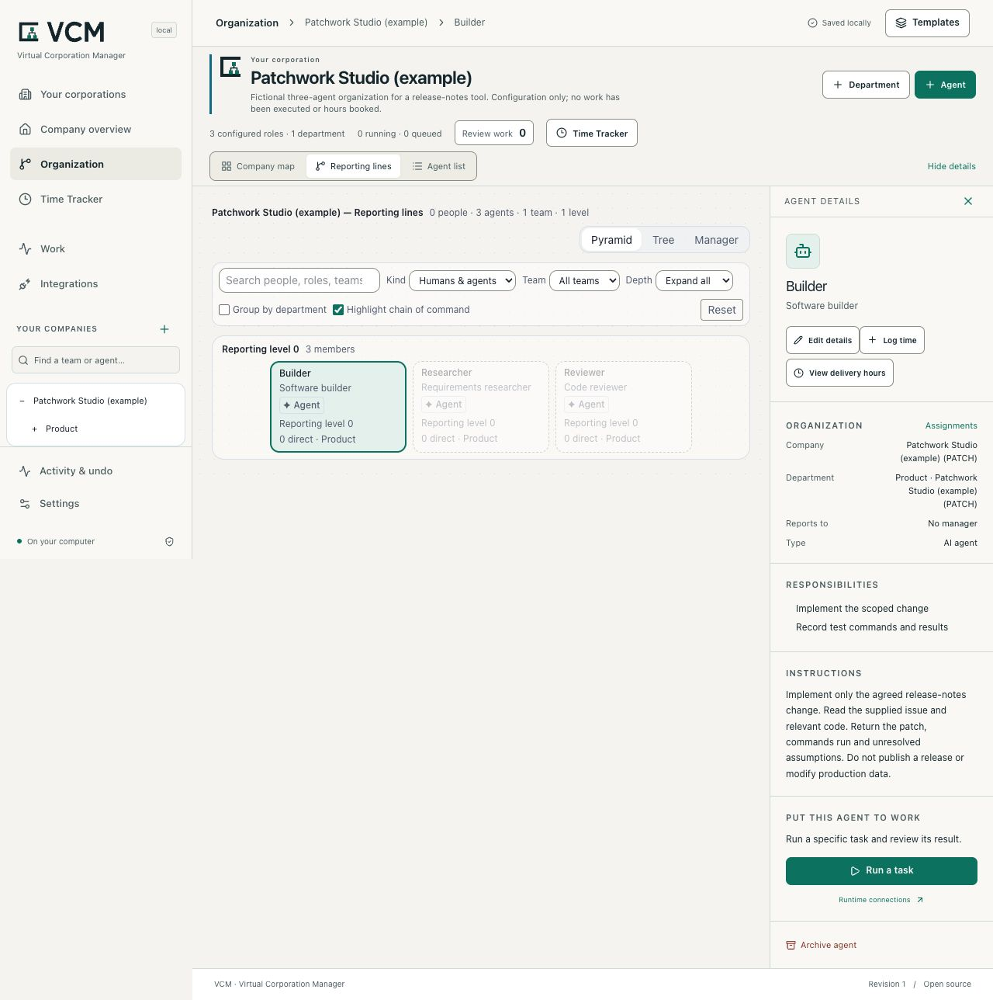

# VCM — Virtual Corporation Manager

**Your agent company. On your machine.**

VCM is an MIT-licensed local workspace for developers who manage agent roles across work sessions. Keep corporations, departments, responsibilities, reporting lines and delivery-hour records in SQLite. Inspect a change before saving it, then reopen the same organization later. One developer operates the workspace on their own machine.

If your roles currently live in a document, prompts or scripts, try representing one real project in VCM and compare the effort of maintaining it. VCM stores the context you enter; it does not synchronize arbitrary chats or make configured agents execute automatically.

**Local review candidate: `0.1.0-alpha.5-local.1`, prepared 5 September 2026; unpublished.** The commands below require the supplied candidate archive or its reviewed checkout. Public alpha.2 is an earlier release and does not contain this interface, the Time Tracker or company file workflows. A version string alone is insufficient: use the candidate's source revision and archive SHA-256 from its handoff. Check the [release page](https://github.com/strobl/virtual-corporation-manager/releases) for actual public availability.

[Developer quickstart](docs/developer-quickstart.md) · [Three-agent example](docs/examples/README.md) · [Architecture and data](docs/developer-architecture.md) · [Contribute](CONTRIBUTING.md)



_Actual local candidate: Patchwork is a fictional three-agent example with no executed jobs or booked hours. Reporting relationships and execution are separate._

## Install the local candidate

Use **Node.js 24.14+ in the 24.x line, or Node 26.x**, with npm. The local core supports macOS, Linux and native Windows. No database compiler, provider account or Python installation is needed for corporation management, the Time Tracker or the example below.

Run these commands in the directory containing the exact supplied archive. This installs into a separate folder and starts the candidate's `vcm` binary:

```sh
npm install --offline --ignore-scripts --prefix ./vcm-preview ./gitflash-0.1.0-alpha.5-local.1.tgz
npm exec --offline --prefix ./vcm-preview -- vcm --version
npm exec --offline --prefix ./vcm-preview -- vcm --data-dir ./my-company
```

Expected version: `0.1.0-alpha.5-local.1`. Open the loopback URL printed by the command if the browser does not open. Use the same working directory and `--data-dir` when restarting. Add `--port 4311` if 4310 is occupied, or `--no-open` to open the URL yourself.

The package name and archive prefix remain `gitflash`; **`vcm` is the canonical command and `gitflash` is its compatibility alias**. Both use the same existing `~/.gitflash` default, `GITFLASH_DATA_DIR` setting and explicit `--data-dir`. There is no automatic move to a new data directory and no claim that the npm name `vcm` is available. Technical export and protocol identifiers retain their compatibility names. GitFlash's separate FDE website is unchanged.

To build the supplied candidate checkout instead:

```sh
npm ci --ignore-scripts
npm run check
npm pack
```

Then use the generated archive with the install commands above. Obtaining source and uncached development dependencies needs network access; the supplied archive and local core work offline. See the [source checkout route](CONTRIBUTING.md#fresh-checkout) for branch and review guidance. The public default branch may still be an older version.

## Save a useful organization

1. Open **Your corporations → Set up a corporation**. Enter your project identity. Use an empty structure or the editable small-team starting point.
2. Add the agent roles you actually use, with specific responsibilities and instructions. One useful agent is enough. Departments and reporting lines are optional; add them when your workflow needs them.
3. Choose **Review changes**, inspect the preview, then **Apply changes**. The new corporation opens in **Company overview**. Nothing is created by merely opening or cancelling the form.
4. Stop with Ctrl+C and restart with the same command and data directory. Open the saved corporation, select an agent and make one useful change. Review and apply it, then reload to check the result.

For an inspectable starting point, import [the fictional three-agent example](docs/examples/README.md) through **Settings → Import a company definition**. It includes a builder, reviewer and researcher with concrete responsibilities, no reporting hierarchy, no executed jobs and no booked hours. It is a learning fixture, not a record of adoption or work.

When real work exists, use **Log time** from the company or agent context. **Time Tracker** keeps the weekly ledger, corrections, history and reference estimates. Its 124 reference definitions support human-equivalent delivery-hour bookkeeping. These hours are entered or estimated effort, not measured runtime or proven savings. Saving an organization or accepting a result never creates hours. [Time Tracker guide](docs/time-tracker.md)

## Inspect and recover

**Settings → Export company definition** downloads the current configuration as JSON. Import validates the whole definition and creates fresh IDs; it does not reconcile or overwrite existing companies. Export configuration for reuse and make a SQLite backup for full recovery.

Stop the workspace before these commands. They use the same isolated installation as above:

```sh
npm exec --offline --prefix ./vcm-preview -- vcm export --data-dir ./my-company --output ./company-definition.json
npm exec --offline --prefix ./vcm-preview -- vcm backup --data-dir ./my-company --output ./company-backup.sqlite
npm exec --offline --prefix ./vcm-preview -- vcm restore --data-dir ./restored-company --from ./company-backup.sqlite
npm exec --offline --prefix ./vcm-preview -- vcm doctor --data-dir ./restored-company
```

Backups preserve configuration, work and job records, artifact bytes, time entries, history and recovery receipts. They contain instructions and results in plaintext SQLite; keep them private. Definition export and time export are different, partial formats. The [quickstart](docs/developer-quickstart.md#export-and-recovery) demonstrates all three paths; [recovery](docs/recovery.md) documents locks, failed restores and schema upgrades.

The server binds to loopback. This is a single-operator local product, with no shared accounts or supported LAN/tunnel hosting. See [architecture and data boundaries](docs/developer-architecture.md) and [security](SECURITY.md).

To remove the isolated application, stop it and run `npm uninstall --prefix ./vcm-preview gitflash`. Your default and custom workspace directories remain intact.

## Optional execution

**Work** and **Integrations** are separate optional paths. A configured agent or reporting relationship does not dispatch a task. The local core requires no account, hosted database, billing, cloud inference or telemetry.

Codex execution requires your own installed runtime, authenticated provider access and allowance. Individual tasks return read-only text. The bounded **Product Studio** company workflow uses five sequential roles to create and check a Python stock-alert utility from fictional input. It needs a working macOS or Linux sandbox; its fixed checker is unavailable on native Windows, and stock Ubuntu 24.04 with restricted user namespaces is unsupported for that optional route. This is not an arbitrary workflow engine. Buzz native configuration import has historical evidence; Buzz task dispatch and Slack round trips remain experimental. [Integration prerequisites](docs/integrations.md) · [Product Studio contract](docs/product-studio.md)

## Contribute

Start with a small change you can demonstrate in an isolated workspace. [CONTRIBUTING](CONTRIBUTING.md) contains the checkout, build, example verification and review route. [Starter tasks](docs/developer-contributing.md) include bounded example, documentation and UI work with reproduction steps and acceptance criteria. All necessary context belongs in the repository and issue; private 8090 access and paid provider credentials are not prerequisites.

`npm run check` runs types, tests and build. `npm run test:package` installs and exercises an actual offline tarball. Configured CI coverage is distinct from an observed passing run on the exact source. Historical acceptance remains in [release evidence](docs/acceptance.md); agent verification is not an external developer pilot.

## License and provenance

MIT for the application code. Useful organization, inspector and domain work was selectively adapted from the owner's prior prototype. Private history, hosted infrastructure and private/customer records were excluded. The Time Tracker bundles 124 owner-authorized Shared catalog definitions from the live prototype. Catalog provenance and complete upstream notices for bundled dependencies and adapted component patterns are in [THIRD_PARTY_NOTICES](THIRD_PARTY_NOTICES.md).

The retained Rubik Bold font and earlier vector assets keep their SIL OFL 1.1 attribution in `dist/web/fonts/Rubik-OFL-1.1.txt`. The VCM interface uses system fonts and native SVG assets.
