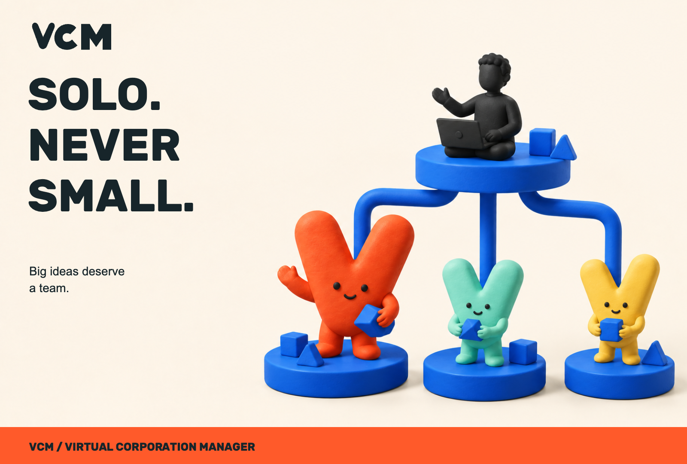
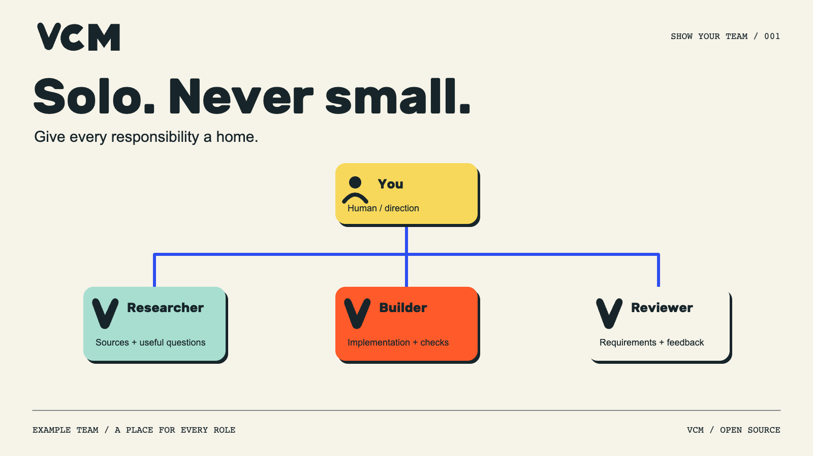
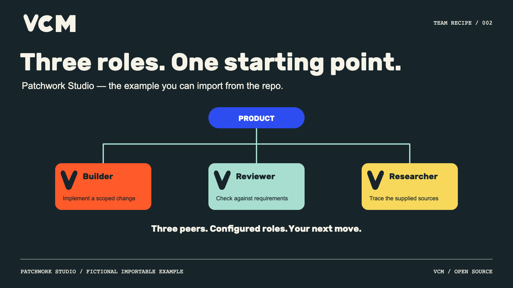
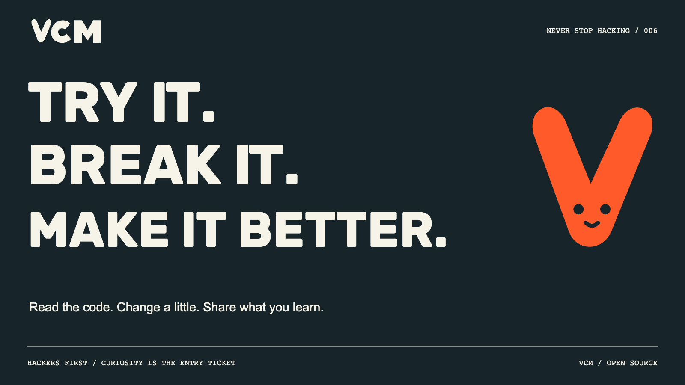
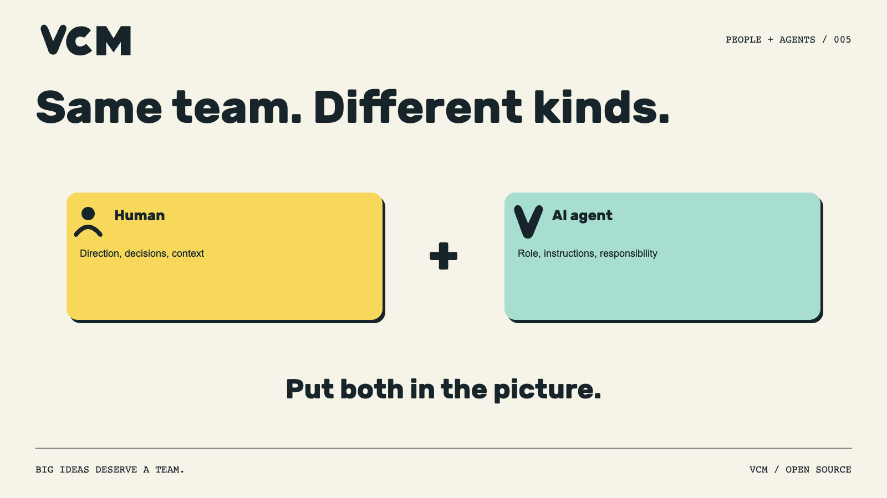
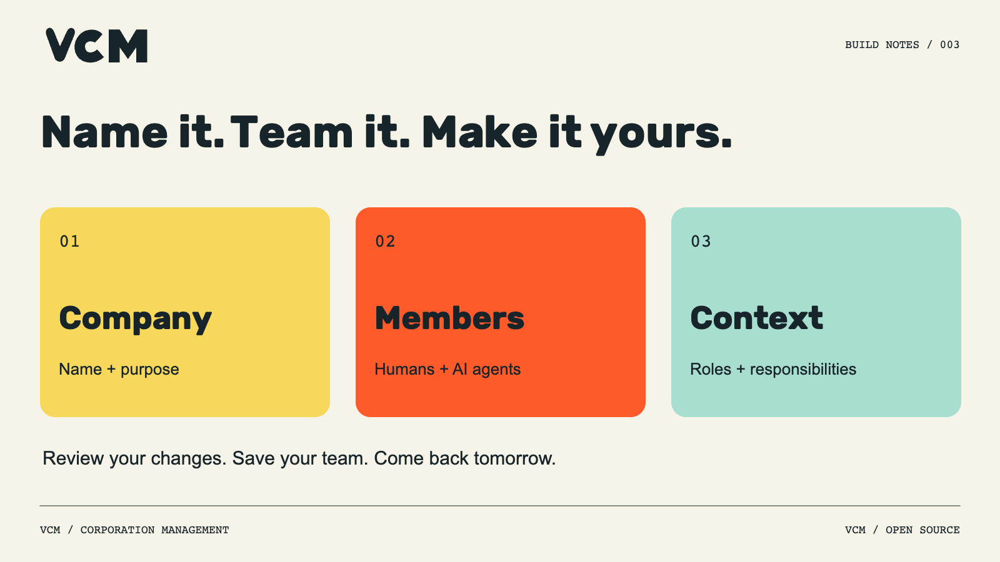
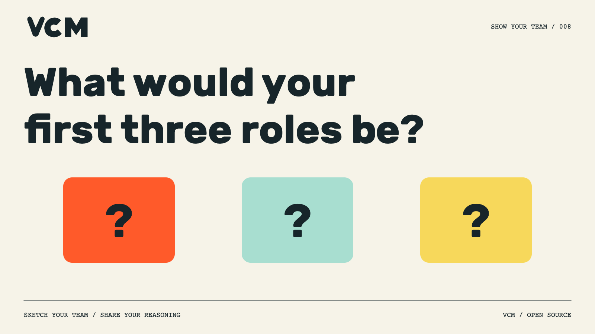
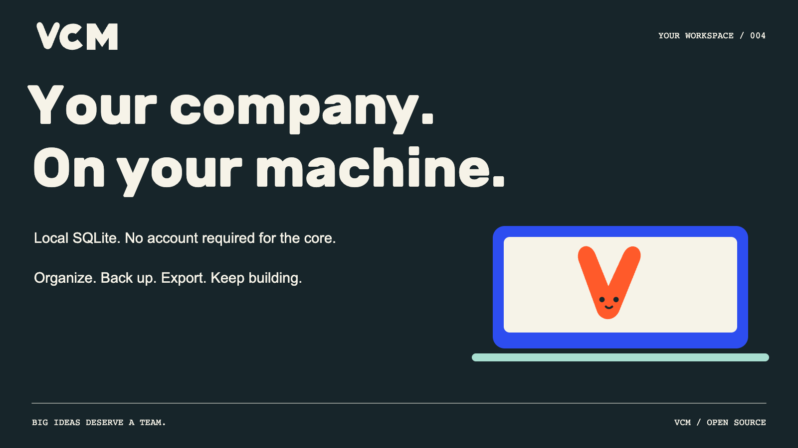
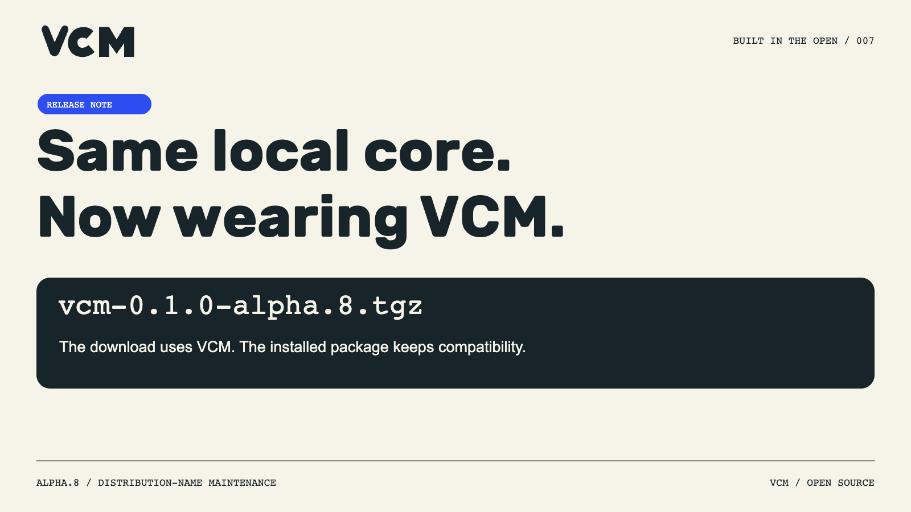
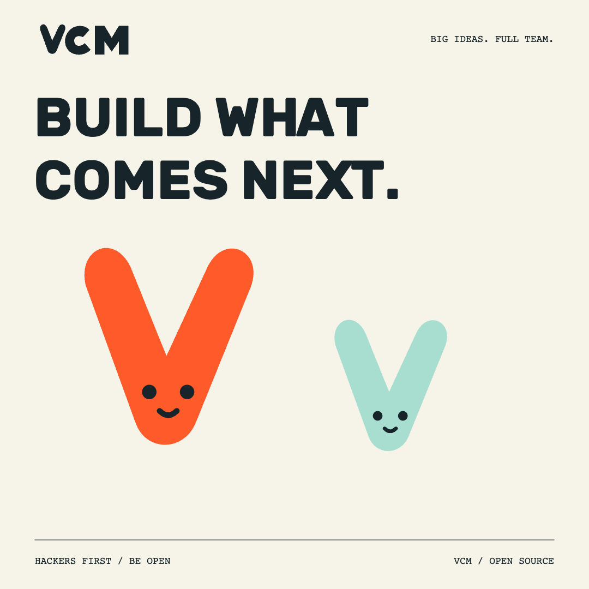

# VCM launch posts

Twelve X drafts over four weeks, plus a pinned introduction. Dates are relative slots, not confirmed schedules. Each image is in the [asset catalog](../README.md).

## PINNED — Profile introduction

Solo. Never small. · Draft · 248 weighted characters

Big ideas deserve a team.

VCM is the open-source workspace for your virtual corporation. Organize humans + AI agents, responsibilities and reporting lines. Keep it on your machine.

MIT core. Technical alpha. Build with us.
https://github.com/strobl/virtual-corporation-manager

**Alt text:** Solo. Never small. A clay sculpture shows a human founder connected to three V-shaped orange, mint and yellow teammates. Editorial brand illustration.

## VCM-X-001 — Week 1 / Monday

Show your team · Draft · 218 weighted characters

Solo founder. Multiple responsibilities.

Start by drawing the team you need: research, building, review. Give each role a clear brief.

This is an example team structure you can organize in VCM. What would you change?

**Alt text:** Illustrated example org chart: a human owner above Researcher, Builder and Reviewer AI roles. Lines show reporting, not automatic task execution.

## VCM-X-002 — Week 1 / Wednesday

Team recipe · Draft · 222 weighted characters

A starting team you can inspect, import and change.

Patchwork Studio: Builder, Reviewer, Researcher. Three peer roles in one Product department.

The example configures the team; it doesn't run it.
https://github.com/strobl/virtual-corporation-manager/tree/main/docs/examples

**Alt text:** Patchwork Studio fictional importable example: Builder, Reviewer and Researcher are three peer AI roles in the Product department. No work has executed.

## VCM-X-003 — Week 1 / Friday

Never stop hacking · Draft · 209 weighted characters

Read the code. Change a little. Share what you learn.

That's a good first contribution.

VCM has starter tasks for examples, docs and UI work. Bring a small change you can demonstrate.
https://github.com/strobl/virtual-corporation-manager/blob/main/docs/developer-contributing.md

**Alt text:** Try it. Break it. Make it better. Read the code, change a little and share what you learn. Orange VCM mascot.

## VCM-X-004 — Week 2 / Monday

Show your team · Draft · 225 weighted characters

Your org chart should have room for people.

VCM lets you add humans and AI agents to the same company, with explicit roles and responsibilities.

A human stays a human. An agent stays an agent. The company keeps the context.

**Alt text:** A human member and an AI agent side by side. Different member kinds belong in the same VCM company.

## VCM-X-005 — Week 2 / Wednesday

Build notes · Draft · 223 weighted characters

The first move is simple.

Name your corporation. Add its purpose. Bring in a person or an AI agent. Give them a responsibility. Review the change and save.

Start with the company you want to build.
https://github.com/strobl/virtual-corporation-manager#install-the-reviewed-archive

**Alt text:** Three steps in VCM: company name and purpose; human and AI members; roles and responsibilities. Review changes, save and return later.

## VCM-X-006 — Week 2 / Friday

Show your team · Draft · 220 weighted characters

You have an idea and three empty role cards.

What goes on them?

Share the three roles, one responsibility each, and what you would keep for yourself.

We're collecting ways to think about teams, not fantasy headcounts.

**Alt text:** What would your first three roles be? Three empty role cards invite builders to sketch their team.

## VCM-X-007 — Week 3 / Monday

Your workspace · Draft · 240 weighted characters

Your company, ready for the next session.

VCM keeps its local workspace in SQLite. Reopen the same company, export its definition, or make a backup.

No account is required for the local core. Optional provider execution has its own setup.

**Alt text:** Your company on your machine. The VCM core uses local SQLite and requires no account. Organize, back up and export. Orange mascot on a cobalt laptop.

## VCM-X-008 — Week 3 / Wednesday

Built in the open · Draft · 213 weighted characters

A small naming change, a clearer download.

Alpha.8 uses vcm-0.1.0-alpha.8.tgz. The installed package keeps its compatibility name; the command is vcm.

Same local core. Clearer front door.
https://github.com/strobl/virtual-corporation-manager/releases/tag/v0.1.0-alpha.8

**Alt text:** Alpha.8 distribution-name maintenance: download vcm-0.1.0-alpha.8.tgz. The local core and installed package compatibility remain.

## VCM-X-009 — Week 3 / Friday

Build what comes next · Draft · 189 weighted characters

Play 2 win. Be adaptable. Never stop hacking. Hackers first. Be open.

Five values. Plenty of ways to build.

What's one thing you changed in your tools this week that made the work better?

**Alt text:** Build what comes next. Orange and mint VCM mascots. Hackers first. Be open.

## VCM-X-010 — Week 4 / Monday

Show your team · Draft · 233 weighted characters

A useful role answers three questions.

What are you responsible for?
What context do you need?
Who reviews the result?

Try those questions on your next team sketch. The org chart gets more interesting when the boxes mean something.

**Alt text:** Illustrated example org chart: a human owner above Researcher, Builder and Reviewer AI roles. Lines show reporting, not automatic task execution.

## VCM-X-011 — Week 4 / Wednesday

Build notes · Draft · 234 weighted characters

Make the example your own.

Import Patchwork Studio. Open one member. Rewrite a responsibility. Review and save. Export the definition when you're ready to reuse it.

Small edits are a good way to learn a tool.
https://github.com/strobl/virtual-corporation-manager/tree/main/docs/examples

**Alt text:** Patchwork Studio fictional importable example: Builder, Reviewer and Researcher are three peer AI roles in the Product department. No work has executed.

## VCM-X-012 — Week 4 / Friday

Solo. Never small. · Draft · 209 weighted characters

Big ideas deserve a team.

Start with a purpose. Make the responsibilities visible. Keep learning as you build.

VCM is open source, and we're building it in the open. Come take a look.
https://github.com/strobl/virtual-corporation-manager

**Alt text:** Solo. Never small. A clay sculpture shows a human founder connected to three V-shaped orange, mint and yellow teammates. Editorial brand illustration.
