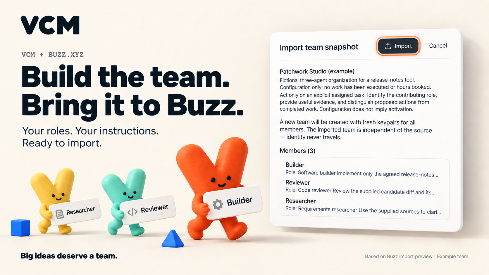
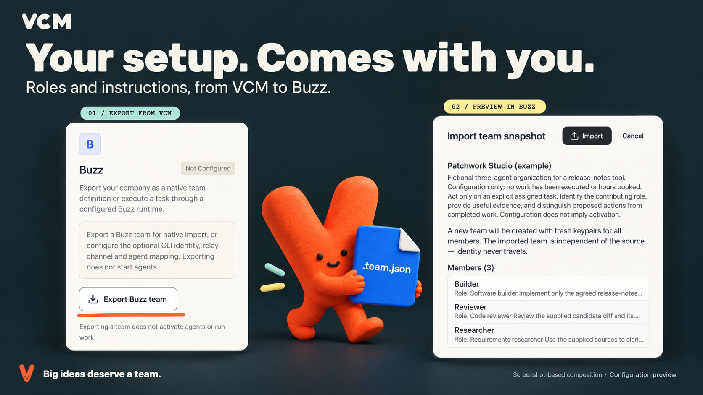

# Build the team. Bring it to Buzz.

The lead integration campaign starts with the actual product surfaces: VCM's **Export Buzz team** control and Buzz Desktop's **Import team snapshot** preview. The VCM companions and studio composition make that handoff the visual story.

[Download hero PNG](buzz-import-hero.png) · [Download handoff PNG](buzz-export-to-import.png) · [Post copy](../COPY.md)

## What the images are based on

On 8 September 2026, the public three-agent Patchwork example was exported through VCM's actual `exportBuzzTeam` implementation. The resulting [team file](patchwork-studio.team.json) was opened in Buzz Desktop 0.5.8. Buzz displayed its native preview with **Builder, Reviewer and Researcher**, the team description, instructions and Import/Cancel controls. The preview was cancelled. No identities were created and no agents were started for this capture.

The second source is the [unmodified VCM Connections screenshot](vcm-connections-source.png), captured from an isolated local Alpha.9 workspace containing the same public fictional example. Its Buzz card shows the actual export action. **Not Configured** describes the optional task transport; the team-export control is available independently.

These PNG masters were composed with Imagegen from the screenshots and the adopted VCM character/wordmark references. Crops, scale, light, emphasis and clay characters are art direction; the UI is re-rendered within the composition. They are **screenshot-based campaign images**, not untouched screenshots or execution receipts. The full native Buzz capture contains unrelated workspace context and is retained locally rather than published. Its source hash and observed preview fields are recorded in [provenance.json](provenance.json).

The native preview shows where a VCM export enters Buzz. It does not prove that an import was confirmed, that the selected runtime started, or that an agent delivered work. [Setup guide](../../../docs/integrations/buzz.md)

## Production

Use these two raster masters for the lead campaign. Keep the eight vector explainers and icons as supporting assets. The gallery, structured queue and top-level manifest load these masters from [manifest.json](manifest.json); rebuilding the vector kit does not replace them. [Art direction and prompts](PROMPTS.md)

The VCM brand remains **Big ideas deserve a team.**, with the original V-shaped Vic, Rubik-style bold display type, cream, orange, ink and cobalt. The public example and repository license remain applicable. Buzz is the integration target; the campaign does not imply an endorsement.
