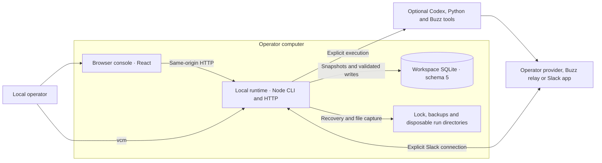
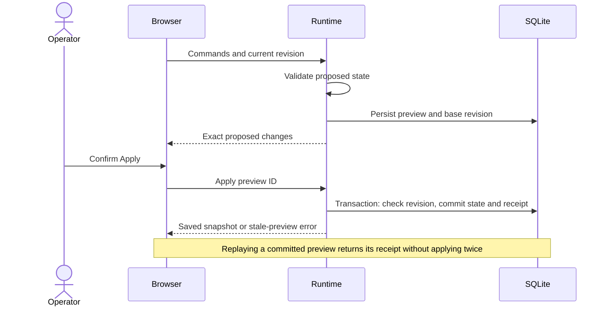

# VCM system architecture

This is the source map for the `0.1.0-alpha.11` corporation-management technical prerelease. VCM is a local workspace for one operator to maintain companies, human and AI members, responsibilities, reporting, membership and company relationships, and explicitly book delivery hours. Optional execution uses the operator's tools and provider access. The [product contract](product/corporation-management.md), [architecture overview](architecture.md), [contributor model](developer-architecture.md) and [acceptance evidence](acceptance.md) provide the surrounding contracts. Earlier local acceptance and published alpha.5/alpha.6 evidence retain their original source and package identities.

## Three core containers

A container here means an application or data store, not a Docker deployment. CLI, HTTP routing and the services below share one Node process.

| Core container     | Responsibilities                                                                                                                                                                                                | Source                                                                                                       |
| ------------------ | --------------------------------------------------------------------------------------------------------------------------------------------------------------------------------------------------------------- | ------------------------------------------------------------------------------------------------------------ |
| Browser console    | Company setup, company/member workspace and reviewed management edits; existing Time Tracker and secondary execution/organization tools. Reads snapshots and retains pending Apply identity in session storage. | [App](../src/web/App.tsx), [client](../src/web/client.ts), [change recovery](../src/web/change-recovery.ts)  |
| Local runtime      | CLI lifecycle, loopback/static HTTP, domain validation, storage and optional task/job coordination.                                                                                                             | [CLI](../src/cli/index.ts), [server](../src/server/index.ts), [build](../scripts/build.mjs)                  |
| Workspace database | `<dataDir>/workspace.sqlite`; authoritative configuration, history, work, time and workflow evidence. Several connections live within the same runtime under its workspace lock.                                | [workspace store](../src/db/store.ts), [time store](../src/time/store.ts), [job store](../src/jobs/store.ts) |

The lock, backups and scratch directories are supporting local files. Codex/Python/Buzz processes and remote provider or transport services are optional boundaries. Git hosting and package distribution are delivery tooling, not runtime dependencies. There is no hosted sync or browser database acting as the source of truth.

## Component map

| Area                         | Component boundary and behavior                                                                                                                                                                                                                 | Source                                                                                                                                                                                                                                                   |
| ---------------------------- | ----------------------------------------------------------------------------------------------------------------------------------------------------------------------------------------------------------------------------------------------- | -------------------------------------------------------------------------------------------------------------------------------------------------------------------------------------------------------------------------------------------------------- |
| Startup and identity         | Resolve `--data-dir`, then `GITFLASH_DATA_DIR`, then `~/.gitflash`; own shutdown and CLI recovery commands. `vcm` is the only installed CLI command. Public identity is VCM; package/data/wire identifiers retain compatibility.                | [CLI](../src/cli/index.ts), [brand](../src/brand.ts), [package](../package.json)                                                                                                                                                                         |
| Company workspace            | Name and optional purpose create an empty company; the company index opens one composed roster, member inspector, departments, reporting, relationships and hours summary. Human and AI members share reviewed editing and assignment controls. | [quick setup](../src/web/QuickCompanySetup.tsx), [company index](../src/web/CorporationWorkspace.tsx), [CompanyConsole](../src/web/CompanyConsole.tsx), [view model](../src/web/company-console-model.ts), [edit/review dialogs](../src/web/Dialogs.tsx) |
| Secondary organization tools | Retain the detailed company map, reporting/list views and advanced membership/relationship editing over the same domain state. These are not a second company database or a required setup journey.                                             | [App composition](../src/web/App.tsx), [org chart](../src/components/organization/CorporationOrgChart.tsx), [company map](../src/web/CompanyMap.tsx), [advanced dialogs](../src/web/AdvancedDialogs.tsx)                                                 |
| Domain and definitions       | Validate typed commands, references, lifecycle, assignments and reporting/ownership cycles. Portable schema-1 imports remap IDs and append configuration.                                                                                       | [contracts](../src/domain/contracts.ts), [model](../src/domain/model.ts), [graph rules](../src/domain/graph.ts), [templates](../src/company/templates.ts)                                                                                                |
| Reviewed persistence         | Validate migrations/data, lock the workspace, preview/apply/replay, audit and supported undo; verify backup and restore.                                                                                                                        | [store](../src/db/store.ts), [backup](../src/db/backup.ts)                                                                                                                                                                                               |
| Delivery hours               | Integer-tenths calculations, captured basis, catalog, corrections/voids, request receipts and analytics.                                                                                                                                        | [rules](../src/time/rules.ts), [store](../src/time/store.ts), [Time Tracker](../src/web/TimeTracker.tsx)                                                                                                                                                 |
| Individual work              | A human can submit completed manual text with no run ID or duration. Only active AI agents can enter the optional task queue. Retain captured run context, output and transport receipts; work acceptance remains a separate reviewed command.  | [human result dialog](../src/web/HumanResultDialog.tsx), [Work](../src/web/Work.tsx), [coordinator](../src/adapters/index.ts), [Codex](../src/adapters/codex.ts), [Buzz](../src/adapters/buzz.ts), [Slack](../src/adapters/slack.ts)                     |
| Company workflow             | Fixed PS-001 stages, bounded queue/repair/retry, actual file capture, independent checks and explicit owner decision.                                                                                                                           | [Jobs](../src/web/Jobs.tsx), [service](../src/jobs/service.ts), [content](../src/jobs/content.ts), [file capture](../src/jobs/files.ts), [runtime adapter](../src/adapters/workflow-codex.ts), [checker](../src/adapters/workflow-check.ts)              |
| Workflow evidence            | Persist artifacts with ownership/hash validation; reconstruct and validate immutable ZIPs using frozen provenance.                                                                                                                              | [contracts](../src/jobs/contracts.ts), [job store](../src/jobs/store.ts), [ZIP writer](../src/jobs/zip.ts)                                                                                                                                               |

## Persisted data

The product's **member** maps to the existing `Agent` type and `agents` table, with `kind` equal to `human` or `agent`. This UI composition adds no separate Human table, user account, per-company profile copy or new database schema. Assignment, reporting and ownership rules remain in the domain validator; see [data-model semantics](data-model.md#company-structure).

The 19 application tables share SQLite schema 5. [Base migrations](../src/db/store.ts), [time migration](../src/time/store.ts) and [workflow migration](../src/jobs/store.ts) are versioned and checksummed. Existing migration SQL is immutable.

| Tables                                                                       | Stored meaning                                                                                                                                                                       |
| ---------------------------------------------------------------------------- | ------------------------------------------------------------------------------------------------------------------------------------------------------------------------------------ |
| `schema_migrations`, `workspace_meta`                                        | Migration/checksum journal and shared configuration/time revision.                                                                                                                   |
| `companies`, `departments`, `agents`                                         | Company identity, grouping, human/agent profile, instructions and optional reporting parent.                                                                                         |
| `assignments`, `relationships`                                               | Dated primary/additional company assignments; separately typed company ownership/collaboration.                                                                                      |
| `previews`, `changes`                                                        | Proposed state/base revision, applied receipt, before/after audit and undo authority.                                                                                                |
| `work`, `integration_runs`                                                   | Supplied or executed output and explicit acceptance; unique task requests, captured context and lifecycle/transport evidence.                                                        |
| `time_meta`, `time_entries`, `time_history`, `time_catalog`, `time_requests` | Timezone, booked entries/captured basis, correction history, catalog versions and idempotency receipts.                                                                              |
| `workflow_jobs`, `workflow_artifacts`, `workflow_requests`                   | Captured job/roles/content, stages and owner decision; exact UTF-8 files with hashes/source/ownership; retry receipts. New bundle bindings use optional fields in existing job JSON. |

Configuration replacement preserves the separate time, integration and workflow ledgers. Captured historical labels and identities remain inspectable after configuration changes. Runtime receipts do not all advance the configuration revision. The normal snapshot returns the organization and latest 200 audit entries; full history remains in SQLite. This is a bounded local design, without a distributed database or unbounded-scale guarantee.

## Control and data flows

**Corporations** is the primary index. Creating a company uses **Company name** and optional **Purpose → Continue → Create company**, producing an empty company through `definition.import`. Its `CompanyConsole` lets the operator **Add member** with **Human** or **AI agent**, then review, save and reopen that same identity. Selection keeps company context in `?area=`/`?selected=` screen state. A shared member's company assignment does not replace its global profile or reporting parent. The company's hours total selects the whole company before opening the existing Time Tracker; member **Log time** supplies the member ID to its existing booking form.

**Tools → Agent runs & records** opens individual runs and manual records, with **Workflow examples** as a separate tab. **Tools → Connections** handles optional runtimes; **Tools → Organization tools** holds the detailed map/reporting/list views. A human's **Record work → Review result → Apply changes** uses `work.record` with `provenance: 'manual'`, `status: 'submitted'`, `runId: null` and `durationMs: null`. No queue admission or time mutation occurs.

Time writes use a separate explicit ingress. An entry or catalog mutation, history, receipt and revision commit together. A 1–50 entry ingress batch reports individual results; the whole batch is not atomic. A booking or correction invalidates older configuration previews. Runtime duration, successful QA and accepted output never create time entries.

Individual execution captures an active AI agent and its primary company context before adapter dispatch; both the UI's target helper and runtime coordinator use the same primary-assignment rule. Merely viewing a shared agent from another company does not change that execution company. The confirmation names the actual target. The queue admits at most 20 active-plus-queued requests and runs one at a time. Request identity prevents duplicate dispatch; output and owner acceptance are separate records. Humans cannot enter this queue.

PS-001 captures five distinct active AI role identities assigned to the chosen company, a named owner and pinned inputs/content. Human members do not satisfy workflow seats. After local prerequisite checks, intake → requirements → build → QA → handoff run sequentially in distinct observed sessions. Actual files are captured; reply code blocks are not artifacts. A fixed Python oracle checks the candidate and a different QA session records criteria and observed commands. There is one active workflow and at most three active-plus-queued jobs, including retries. Start/Retry admission is transactional; refusal consumes no retry request or allowance. A successful retry's replay remains idempotent when the queue is full. Ordinary repairs and explicit runtime retries are each bounded at two. The separate individual-task queue may run alongside this workflow.

At `waiting_owner`, new completed workflows seal a format-2 ZIP with the complete producer/support file set, pinned `EXPECTED-REFERENCE.json`, QA/handoff outputs, stage evidence and frozen pre-decision `PROVENANCE.json`. Its file count is not fixed. `job.bundle` stores its SHA-256 and byte length outside the ZIP, avoiding a self-referential hash. Explicit accept/reject validates the bytes and stores `ownerReview.bundleSha256` atomically with the decision. Later downloads and restored downloads remain byte-identical. The full evidence JSON separately includes the current owner decision. Historical format-1 downloads retain their original file selection and bytes, including known omissions. Historical decided records without a bundle binding remain unbound; an old undecided job is sealed only when a new explicit decision occurs. The [Product Studio contract](product-studio.md) separates this implemented format from actual useful-result acceptance.

## Trust, recovery and operating limits

The [HTTP boundary](../src/server/index.ts) checks Host, Origin, cross-site requests and static paths. Mutations require JSON and a random per-process `X-GitFlash-Token` obtained from `/api/session`. Trusted local processes can retrieve it; this is loopback protection, not account authentication. The alpha routes are implementation interfaces, not a stable external SDK. Requests are limited to 2 MB and configuration batches to 1,000 commands. Shared LAN serving, tunnels and multi-user permission management are outside this deployment model.

Startup obtains an exclusive workspace lock, validates migrations and contents, and backs up before an upgrade. SQLite uses foreign keys, WAL and transactions. Local permissions restrict data files where supported; the app does not encrypt data or backups. Workflow capture rejects links, unsafe paths, invalid UTF-8 and oversized files. Sandbox controls restrict writes and shell networking without promising full OS-user read isolation. See [security](../SECURITY.md) and [integration prerequisites](integrations.md).

Definition JSON exports configuration; time JSON exports the ledger/catalog/history; workflow JSON and ZIP export execution evidence and deliverables. Only full SQLite backup/restore preserves all stores and replay receipts together. Restore verifies artifact ownership, hashes, stage/session evidence and new bundle/decision bindings before replacement. Scratch directories are unnecessary for captured deliverables; provider credentials and installed tools remain external. Restart fails interrupted/queued workflow jobs for explicit recovery and does not replay provider calls automatically.

The local core uses supported Node 24.14+ in 24.x or Node 26.x on macOS, Linux and Windows. Optional workflow checking additionally needs Python 3.8+ and a working macOS/Linux Codex sandbox; native Windows and unsupported Linux sandbox configurations fail preflight. Buzz and Slack remain experimental with separate identity/transport prerequisites. The [acceptance record](acceptance.md) distinguishes implementation and fixture checks from actual provider, platform and installed-package results.

The real PS-001 v2 intake and its one retry each timed out after 300 seconds at `ultra`; no v2 bundle or owner acceptance exists. The earlier v1 download remains rejected for its missing expected-reference file. Management usefulness, scale/configuration capacity, real optional execution and live Buzz/Slack outcomes require separate evidence. Internal examples do not establish external human usefulness, and this source map does not establish alpha.7 publication or authorize a new provider attempt.
